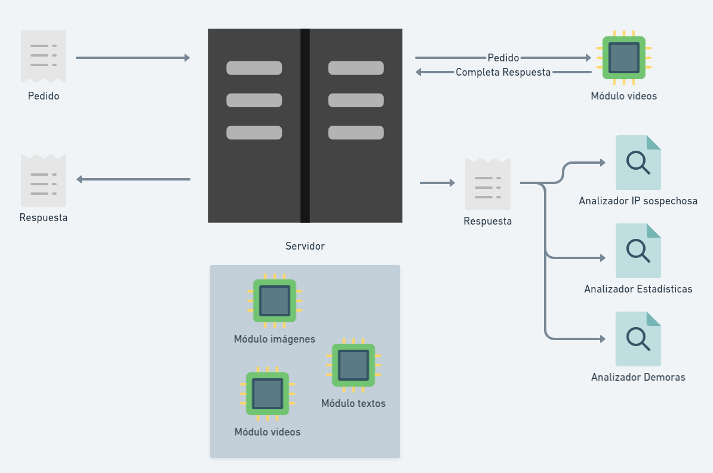

# Simulador de servidor web

Este ejercicio está pensado para ser resuelto utilizando la técnica TDD. El código que se incluye fue programado de esa manera, puede verse el [video con el paso a paso en YouTube](https://youtu.be/tgJnN4f04ug).

Se pide completar todos los requerimientos que faltan, **siguiendo la misma metodología**. Para que quede claro: no alcanza con que el código funcione y haga lo que tiene que hacer, además pedimos que se resuelva haciendo TDD. Como es imposible verificar si lo hicieron así o no, en la corrección haremos mucho especial hincapié en los tests.

## Funcionamiento básico

Se nos pide modelar la estructura de un servidor web que atiende **pedidos**. Cada pedido indica:
* la IP de quien hace el pedido. Para este ejercicio se puede manejar como un `String`, por ejemplo: `"207.46.13.5"`;
* día y hora del pedido. Se recomienda usar para esto la clase `LocalDateTime`;
* la URL que se está requiriendo, por ejemplo `http://pepito.com.ar/documentos/doc1.html`. 

De una **URL** nos van a interesar estos datos, que se describen tomando `"http://pepito.com.ar/documentos/doc1.html"` como ejemplo:
* el protocolo, en este caso `"http"`;
* la ruta, en este caso `"/documentos/doc1.html"`;
* la extensión, en este caso `"html"`.

La respuesta a un pedido consiste de: 
* tiempo que tardó en responder (en milisegundos); 
* un [código de respuesta](https://es.wikipedia.org/wiki/Anexo:C%C3%B3digos_de_estado_HTTP);
* un _body_ o contenido que será un `String`;
* una referencia al pedido que la generó.

Los servidores que modelemos van a aceptar solamente el protocolo HTTP. Si el protocolo de la URL es distinto a "http" hay que devolver código de respuesta 501 (servicio no implementado). Para este y los errores que se definen más adelante vamos a devolver body vacío y tiempo de respuesta 10 milisegundos.

## Módulos

Un servidor web deriva todos los pedidos que acepta a un módulo. Al servidor web se le pueden cargar la cantidad de módulos que corresponda. 

Para esta simulación vamos a soportar módulos que trabajan según la extensión del recurso que se está solicitando: por ejemplo, podríamos tener un módulo de imágenes que trabaja con `jpg`, `png` y `gif`, otro de texto que trabaja con `docx`, `odt`, etcétera.

De cada módulo se debe configurar:
* con qué extensiones puede trabajar (una colección),
* qué devuelve (un texto fijo),
* cuánto tarda (un número, también fijo).

Cuando se recibe un pedido, se le pregunta a todos los módulos que tiene configurados si lo pueden atender o no. El servidor deriva el pedido al primer módulo que le dice que sí. La respuesta debe contener el body y el tiempo de respuesta definido por el módulo, el código de respuesta 200 (OK) y el pedido que la generó.

Si no hay ningún módulo que pueda atender el pedido, hay que devolver código de respuesta 404 (Not found) y lo explicado más arriba sobre los errores.

## Analizadores

A un servidor también se le tienen que poder agregar analizadores, que son objetos que registran y/o analizan distintos aspectos del tráfico. Puede no haber ningún analizador, uno o muchos. Se tienen que poder agregar y quitar dinámicamente.

Ante cada pedido que atiende, el servidor le envía _a todos_ los analizadores que tenga asignados en ese momento la respuesta y el módulo que la generó.

Implementar los siguientes analizadores:

### Detección de demora en respuesta

Se le configura una demora mínima en milisegundos. Una respuesta cuyo tiempo de respuesta supere la demora mínima se considera demorada. Se le tiene que poder preguntar, para un módulo, la cantidad de respuestas demoradas.

### IPs sospechosas

Se le carga una colección de IPs sospechosas, y debe ir registrando todos los pedidos que estas IPs realizaron. A partir de eso, se debe poder consultar:

* cuántos pedidos realizó una cierta IP sospechosa,
* cuál fue el módulo más consultado por todas las IPs sospechosas,
* el conjunto de IPs sospechosas que requirieron una cierta ruta.

Ayuda: las consultas que se piden tienen que ser métodos del analizador, no del servidor. 

### Estadísticas

A este se le tiene que poder preguntar: tiempo de respuesta promedio, cantidad de pedidos entre dos momentos (fecha/hora) que fueron atendidos, cantidad de respuestas cuyo body incluye un determinado `String` (p.ej. cuántas respuestas dicen "hola", lo que incluye "hola amigos" y "ayer me dijeron hola 4 veces"), porcentaje de pedidos con respuesta exitosa.

Los objetos `LocalDateTime` tienen dos métodos que pueden resultar útiles: `fecha.isBefore(otraFecha)` y `fecha.isAfter(otraFecha)`, que indican si la otra fecha está antes o después, respectivamente.
